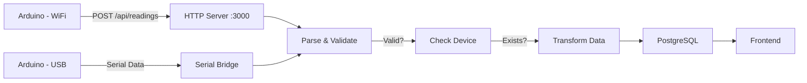

# IoT Gateway - StaySafe Architecture

## What is IoT Gateway?

**IoT Gateway** is a central server that acts as a "bridge" between:
- **IoT Nodes** (Arduino devices with sensors)
- **Cloud and Applications** (Frontend, analysis, notifications)

Gateway responsibilities:
- Receives data from multiple IoT nodes
- Validates and transforms data
- Stores data in central database
- Distributes data to other systems
- Monitors node status
- Manages sensor configuration

---

## IoT Gateway in StaySafe

In our system, **IoT Gateway** is implemented as:

### **Backend API Server** (Node.js + Express)
```
┌─────────────────────────────────────────┐
│        IoT Gateway (Backend)             │
├─────────────────────────────────────────┤
│                                         │
│  Node.js + Express Server               │
│  REST API (:3000)                       │
│  mDNS Hostname Resolution               │
│  Serial Bridge Listener (9600 baud)    │
│  PostgreSQL Connection Pool             │
│  Device & Sensor Management             │
│  Health Monitoring & Alerts             │
│                                         │
└─────────────────────────────────────────┘
```

### **Gateway Components:**

| Component | Role | Description |
|-----------|------|-------------|
| **HTTP Server** | Data ingestion | `POST /api/readings` from Arduino |
| **Serial Bridge** | USB fallback | Data reception via USB cable (9600 baud) |
| **mDNS Resolver** | Hostname discovery | Resolves `staysafe.local` to IP address |
| **PostgreSQL Pool** | Database connection | Connection pooling |
| **Validation Layer** | Data integrity | JSON validation, device existence check |
| **Business Logic** | Data transformation | Calculations, aggregation, alert generation |
| **Scheduler** | Periodic tasks | Health checks, cleanup, maintenance |

---

## IoT Gateway Process Flow



---

## Gateway Data Flow

### **1. Data Ingestion**

Arduino sends:
```json
POST /api/readings
{
  "deviceId": 1,
  "timestamp": "2026-04-26T14:30:00Z",
  "temperature": 22.5
}
```

Gateway HTTP Server receives and parses JSON.

### **2. Data Validation**

Gateway checks:
- Valid JSON syntax?
- Required fields present (deviceId, temperature, timestamp)?
- Correct data types?
- Device exists in database?
- Values in valid range?

If all valid → Continue
If error → Return 400/404 error

### **3. Data Transformation**

Raw data:
```json
{
  "deviceId": 1,
  "temperature": 22.5,
  "timestamp": "2026-04-26T14:30:00Z"
}
```

Transformed data:
```json
{
  "device_id": 1,
  "sensor_type": "temperature",
  "value": 22.5,
  "unit": "°C",
  "recorded_at": "2026-04-26T14:30:00Z",
  "created_at": NOW()
}
```

### **4. Data Storage**

```sql
INSERT INTO sensor_readings
  (device_id, sensor_type, value, unit, recorded_at)
VALUES
  (1, 'temperature', 22.5, '°C', '2026-04-26T14:30:00Z')
```

Response to Arduino:
```json
{
  "id": 12345,
  "status": "ok"
}
```

### **5. Data Distribution**

Frontend retrieves:
```
GET /api/readings?deviceId=1&limit=100
```

Gateway returns JSON array with readings.
Frontend dashboard displays data.

---

## Gateway API Endpoints

### **Data Ingestion** (IoT Nodes → Gateway)

| Endpoint | Method | Description |
|----------|--------|-------------|
| `/api/readings` | POST | Arduino sends sensor data |
| `/api/controls` | PATCH | Update sensor configuration |

### **Data Retrieval** (Frontend ← Gateway)

| Endpoint | Method | Description |
|----------|--------|-------------|
| `/api/readings` | GET | Retrieve historical data |
| `/api/controls` | GET | Retrieve configuration |
| `/api/alerts` | GET | Retrieve alerts |

### **Health & Status**

| Endpoint | Method | Description |
|----------|--------|-------------|
| `/api/devices` | GET | List all devices |
| `/api/health` | GET | Gateway and node status |

---

## Gateway Architecture Layers

```
Frontend / External Systems
           |
    API Endpoints (REST)
           |
    API Router & Middleware
           |
    Business Logic + Data Handlers
           |
    Data Access Layer (DAO)
           |
    PostgreSQL + Serial Bridge
           |
    IoT Nodes (Arduino)
```

---

## Key Features

**1. Multi-Protocol Support**
- WiFi (Primary) - POST requests via HTTP
- USB Serial (Fallback) - Via Serial Bridge

**2. Device Management**
- Multiple IoT nodes support
- Per-device configuration
- Sensor type management

**3. Data Integrity**
- JSON validation
- Schema enforcement
- Type checking
- Range validation

**4. Health Monitoring**
- Timeout detection
- Offline alerts
- Last reading tracking
- Alert history

**5. Scalability**
- Connection pooling
- Async processing
- Cloud-ready (Neon)
- Multiple concurrent nodes

---

## Deployment

**Development**
```bash
npm run dev
# Gateway runs on http://localhost:3000
```

**Production**
```bash
npm start
# With .env.production configured
# Database: Neon Cloud PostgreSQL
```

---

## Summary

IoT Gateway in StaySafe:
- Central hub for data collection and distribution
- Secure receiver of data from Arduino devices
- Intelligent validator and transformer
- Reliable storage in PostgreSQL
- Distributor of data to frontend and external systems

It is the heart of our IoT system.
