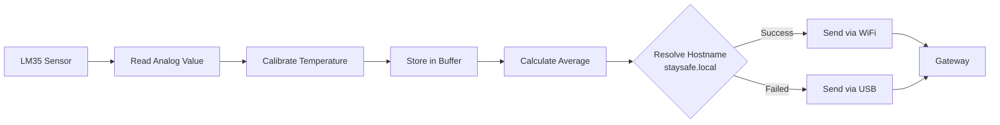

# IoT Node - StaySafe Architecture

## What is IoT Node?

**IoT Node** is a remote device that collects sensor data from the physical environment and sends it to the Gateway (Backend). It acts as the "data collector" in the IoT system.

IoT Node responsibilities:
- Reads sensor data from the physical environment
- Processes and filters sensor readings
- Establishes connection to the Gateway
- Sends data reliably to the backend
- Handles connection failures gracefully
- Manages its own configuration

---

## IoT Node in StaySafe

In our system, **IoT Node** is implemented as:

### **Arduino R4 WiFi with LM35 Temperature Sensor**

```
┌─────────────────────────────────────────┐
│     IoT Node (Arduino R4 WiFi)          │
├─────────────────────────────────────────┤
│                                         │
│  Microcontroller: Arduino R4 WiFi       │
│  Sensor: LM35 Temperature Sensor        │
│  Communication: WiFi + USB Fallback     │
│  Sampling: 10 samples per second        │
│  Send Interval: Every 10 seconds        │
│  Averaging: Moving average filter       │
│                                         │
└─────────────────────────────────────────┘
```

### **IoT Node Components:**

| Component | Role | Description |
|-----------|------|-------------|
| **Microcontroller** | Control & Processing | Arduino R4 WiFi (ARM-based) |
| **Temperature Sensor** | Data Collection | LM35 analog sensor on pin A0 |
| **WiFi Module** | Primary Connection | WiFiS3 library, mDNS support |
| **Serial Port** | Fallback Connection | USB-to-Serial (9600 baud) |
| **Sampling Buffer** | Data Filter | 10-sample moving average |
| **Network Stack** | Communication | TCP/IP, HTTP POST requests |

---

## IoT Node Data Flow



---

## Node Operation Sequence

### **1. Sensor Reading**

Arduino reads LM35 sensor every 100ms:
```
Raw ADC value (0-1023) → Calibration formula → Temperature in Celsius
```

Calibration:
```
temperature = (165.0 - rawValue) * 0.5 + 22.0
```

### **2. Data Buffering**

Arduino stores the last 10 readings in a circular buffer:
```
Time(ms)  | Temp(°C)
0         | 22.1
100       | 22.3
200       | 22.2
...
900       | 22.4
```

### **3. Averaging**

Every 10 seconds, calculate average of buffered readings:
```
Average Temperature = (22.1 + 22.3 + 22.2 + ... + 22.4) / 10 = 22.25°C
```

### **4. Hostname Resolution**

Arduino resolves mDNS hostname to IP address:
```
staysafe.local → 192.168.1.187
```

### **5. Data Transmission**

Arduino sends HTTP POST request:
```json
POST /api/readings HTTP/1.1
Host: staysafe.local:3000
Content-Type: application/json

{
  "deviceId": 1,
  "timestamp": "2026-04-21T10:30:45Z",
  "temperature": 22.25
}
```

### **6. Fallback Mechanism**

If WiFi transmission fails:
- Arduino detects connection failure
- Falls back to USB Serial
- Sends data via serial port (9600 baud)
- Gateway's Serial Bridge receives and forwards to backend

Serial format:
```
[USB_DATA] {"deviceId": 1, "timestamp": "2026-04-21T10:30:45Z", "temperature": 22.25}
```

---

## Node Communication Protocol

### **Primary: WiFi (HTTP POST)**

- Connection method: WiFi 802.11
- Protocol: HTTP/1.1
- Port: 3000
- Discovery: mDNS hostname (staysafe.local)
- Frequency: Every 10 seconds
- Payload: JSON

### **Fallback: USB Serial**

- Connection method: USB cable
- Protocol: Serial communication
- Baud rate: 9600
- Format: Line-based JSON with [USB_DATA] prefix
- Trigger: WiFi connection failure

---

## Node Configuration

### **WiFi Networks**

Arduino attempts connection to multiple networks in order:
```
1. "Vodafone-9EB4"
2. "T-920814"
```

If all networks fail, falls back to USB Serial.

### **Sensor Parameters**

| Parameter | Value | Description |
|-----------|-------|-------------|
| Device ID | 1 | Unique identifier |
| Sensor Type | temperature | Type of measurement |
| Sensor Pin | A0 | Analog input pin |
| Sample Count | 10 | Samples per cycle |
| Sample Interval | 100ms | Time between samples |
| Send Interval | 10000ms | Data transmission frequency |

---

## Key Features

**1. Autonomous Operation**
- No external configuration needed
- Auto-discovery via mDNS
- Self-healing WiFi reconnection

**2. Data Quality**
- Moving average filtering (noise reduction)
- 10 samples per transmission cycle
- Timestamp synchronization

**3. Reliability**
- WiFi with automatic reconnection
- USB Serial fallback
- Multiple WiFi network support
- Connection status monitoring

**4. Low Power Consumption**
- Asynchronous sampling
- Efficient serialization
- Optional deep sleep mode (future)

**5. Easy Integration**
- Standard JSON format
- HTTP POST endpoint
- mDNS hostname discovery
- No special hardware required

---

## Node Deployment

**Hardware Required**
- Arduino R4 WiFi
- LM35 temperature sensor
- USB cable (for fallback + programming)
- WiFi network access

**Setup Steps**
1. Connect LM35 sensor: Signal to A0, Power to 5V, Ground to GND
2. Upload StaySafe_R4_WIFI.ino sketch
3. Configure WiFi networks in sketch
4. Power on Arduino
5. Monitor Serial output to verify connection

---

## Summary

IoT Node in StaySafe:
- Remote sensor data collector
- Reads temperature from LM35 sensor
- Communicates with Gateway via WiFi or USB
- Autonomous operation with mDNS discovery
- Reliable with automatic fallback mechanisms
- Foundation of the monitoring system

It is the eyes and ears of our IoT system.
