# StaySafe Arduino R4 WiFi - IoT Temperature Sensor System

**Complete IoT sensor system** that reads temperature data from an analog sensor and sends it to a cloud backend with automatic fallback to USB serial communication.

---

## 🎯 System Architecture Overview

```
┌─────────────────────────────────────────────────────────────────┐
│                     StaySafe IoT System                         │
├─────────────────────────────────────────────────────────────────┤
│                                                                 │
│  ┌──────────────────┐                                           │
│  │  Arduino R4 WiFi │  ← Microcontroller (32-bit ARM Cortex-M4)│
│  │  + LM35 Sensor   │  ← Temperature sensor (analog pin A0)     │
│  └────────┬─────────┘                                           │
│           │                                                     │
│     ┌─────┴──────────────────────┐                             │
│     │                            │                             │
│  WiFi (Primary)          USB Serial (Fallback)                 │
│     │                            │                             │
│     ↓                            ↓                             │
│  ┌──────────────────┐    ┌──────────────────┐                 │
│  │ Backend API      │    │ Serial Bridge    │                 │
│  │ :3000            │◄───┤ Node.js          │                 │
│  │ /api/readings    │    │ (localhost)      │                 │
│  └────────┬─────────┘    └──────────────────┘                 │
│           │                                                    │
│           ↓                                                    │
│  ┌──────────────────────────────────────┐                     │
│  │   PostgreSQL (Neon Cloud)            │                     │
│  │   sensor_readings table              │                     │
│  │   - deviceId, temperature, timestamp │                     │
│  └────────┬─────────────────────────────┘                     │
│           │                                                    │
│           ↓                                                    │
│  ┌──────────────────┐                                          │
│  │ Frontend         │                                          │
│  │ React/Vite       │                                          │
│  │ Dashboard        │                                          │
│  └──────────────────┘                                          │
│                                                                 │
└─────────────────────────────────────────────────────────────────┘
```

---

## 🛠 Hardware Components

| Component | Model | Purpose | Status |
|-----------|-------|---------|--------|
| **Microcontroller** | Arduino R4 WiFi | Reads sensor & sends data | ✅ Active |
| **Temperature Sensor** | LM35 (3-pin) | Analog temperature measurement | ✅ Connected |
| **Communication** | WiFi (802.11b/g/n) | Primary: Data transmission | ✅ Fallback working |
| **Fallback** | USB Serial (9600 baud) | Secondary: Via cable | ✅ Fallback working |
| **Database** | PostgreSQL (Neon) | Cloud data storage | ✅ Production |
| **Backend** | Node.js + Express | API server | ✅ Running |

---

## 🔌 Wiring Diagram

```
Arduino R4 WiFi Board              LM35 Temperature Sensor
┌─────────────────────┐            ┌────────────────┐
│                     │            │  GND - OUT - 5V│
│  5V   ●─────────────┼────────────┼────┬────┐     │
│  GND  ●─────────────┼────────────┼────┤    │     │
│  A0   ●─────────────┼────────────┼────┴────┘     │
│       │             │            │                │
│  USB  ─────────────── ← Serial Connection        │
│       │             │            │                │
└─────────────────────┘            └────────────────┘
    │
    └─ To Mac/PC
       (for fallback communication)
```

### Pin Connections

| Arduino Pin | LM35 Pin | Purpose |
|------------|----------|---------|
| 5V | PIN 1 (VCC) | Power supply (+5V) |
| A0 | PIN 2 (OUT) | Analog temperature reading |
| GND | PIN 3 (GND) | Ground |

**LM35 Specifications:**
- Output: 10mV per °C
- Range: -55°C to +150°C
- Accuracy: ±0.5°C
- Linear voltage output

---

## 🔄 System Process Flow (Mermaid Diagram)

```mermaid
%%{init: {'flowchart': {'curve': 'linear', 'nodeSpacing': 40, 'rankSpacing': 30}, 'fontSize': 12, 'fontFamily': 'arial'}}%%
graph TD
    A["LM35 Sensor<br/>(Analog Input A0)"] -->|"Read every 100ms"| B["Analog Value<br/>Convert to °C"]
    B --> C["Store in Buffer<br/>(10 samples)"]
    C --> D{"10 sec<br/>interval?"}
    D -->|"No"| C
    D -->|"Yes"| E["Calculate Average<br/>(10 samples)"]
    E --> F["Create JSON Payload<br/>{deviceId, temp, timestamp}"]
    F --> G{"Try WiFi?"}
    
    G -->|"Yes"| H["Resolve Hostname<br/>staysafe.local"]
    H --> I{"Resolution<br/>OK?"}
    I -->|"No"| K["WiFi Failed"]
    I -->|"Yes"| J["Connect to Backend<br/>192.168.1.187:3000"]
    J --> L{"Connection<br/>OK?"}
    L -->|"No"| K["HTTP Failed"]
    L -->|"Yes"| M["Send HTTP POST<br/>/api/readings"]
    M --> N{"Response<br/>200 OK?"}
    N -->|"Yes"| O["✓ Success"]
    N -->|"No"| K["Backend Error"]
    
    K -->|"WiFi/HTTP Fail"| P["USB Fallback<br/>9600 baud"]
    P --> Q["Send [USB_DATA]<br/>JSON via Serial"]
    Q --> R["Serial Bridge<br/>listens on port"]
    R --> S["Forward to Backend<br/>HTTP POST"]
    S --> T{"Response<br/>200 OK?"}
    T -->|"Yes"| O["✓ Success"]
    T -->|"No"| U["Queue for Retry"]
    
    O --> V["Backend API<br/>/api/readings"]
    V --> W["Validate JSON"]
    W --> X["Check Device ID<br/>in Database"]
    X --> Y{"Device<br/>exists?"}
    Y -->|"No"| Z["❌ Error: Device not found"]
    Y -->|"Yes"| AA["INSERT into<br/>sensor_readings table"]
    AA --> AB["PostgreSQL<br/>Neon Cloud"]
    AB --> AC["✓ Data Stored<br/>(id, deviceId, temp, timestamp)"]
    
    AC --> AD["Frontend Fetches<br/>GET /api/readings"]
    AD --> AE["React Dashboard<br/>Updates Display"]
    AE --> AF["Show Temperature<br/>Min/Max/Average/Chart"]
    
    style A fill:#4CAF50
    style O fill:#8BC34A
    style AC fill:#2196F3
    style AF fill:#FF9800
    style K fill:#F44336
    style Z fill:#F44336
```




---

## 📊 Data Flow Diagram (Detailed)

```
┌─────────────────────────────────────────────────────────────┐
│ 1. SENSOR READING (every 100ms)                            │
├─────────────────────────────────────────────────────────────┤
│  Arduino reads analog value from LM35 sensor (Pin A0)      │
│  Converts raw value to Celsius using calibration formula:  │
│  temperature = (165 - rawValue) * 0.5 + 22                │
│  Stores reading in circular buffer (10 samples)            │
└──────────────────────┬──────────────────────────────────────┘
                       ↓
┌─────────────────────────────────────────────────────────────┐
│ 2. DATA AGGREGATION (every 10 seconds)                     │
├─────────────────────────────────────────────────────────────┤
│  Calculates average of 10 sensor readings                  │
│  Creates JSON payload:                                      │
│  {                                                          │
│    "deviceId": 1,                                          │
│    "timestamp": "2026-04-26T14:30:00Z",                    │
│    "temperature": 22.5                                      │
│  }                                                          │
└──────────────────────┬──────────────────────────────────────┘
                       ↓
┌──────────────────────────────────────┬──────────────────────┐
│ 3. TRANSMISSION DECISION             │                      │
├──────────────────────────────────────┤                      │
│ Try WiFi First?                      │                      │
│ ✓ YES → Go to Mode A                 │ NO → Go to Mode B   │
│ ✗ NO  → Go to Mode B                 │                      │
└──────────────────────┬────────────────┴──────────────────────┘
                       │
        ┌──────────────┴──────────────┐
        ↓                            ↓
   MODE A: WiFi (Primary)    MODE B: USB (Fallback)
   ┌──────────────────────┐   ┌──────────────────────┐
   │ 1. Resolve hostname  │   │ 1. Open Serial port  │
   │    staysafe.local    │   │    (9600 baud)       │
   │    ↓                 │   │    ↓                 │
   │ 2. Connect to server │   │ 2. Send [USB_DATA]   │
   │    192.168.1.187:3000│   │    JSON format       │
   │    ↓                 │   │    ↓                 │
   │ 3. POST /api/readings│   │ 3. Serial Bridge     │
   │    (HTTP)            │   │    receives it       │
   │    ↓                 │   │    ↓                 │
   │ 4. Response: 200 OK  │   │ 4. Forward to HTTP   │
   │    ✓ Success!        │   │    backend API       │
   └──────────────────────┘   │    ↓                 │
                              │ 5. Response: 200 OK  │
                              │    ✓ Success!        │
                              └──────────────────────┘
                                       ↓
┌─────────────────────────────────────────────────────────────┐
│ 4. BACKEND PROCESSING (POST /api/readings)                 │
├─────────────────────────────────────────────────────────────┤
│  Backend validates JSON payload                            │
│  Stores in PostgreSQL:                                      │
│    INSERT INTO sensor_readings                            │
│      (device_id, sensor_type, value, unit, recorded_at)   │
│    VALUES (1, 'temperature', 22.5, '°C', timestamp)       │
└──────────────────────┬──────────────────────────────────────┘
                       ↓
┌─────────────────────────────────────────────────────────────┐
│ 5. FRONTEND DISPLAY                                        │
├─────────────────────────────────────────────────────────────┤
│  Frontend fetches: GET /api/readings?deviceId=1           │
│  Updates Dashboard with latest temperature reading        │
│  Displays: Min/Max/Average + Real-time Chart              │
└─────────────────────────────────────────────────────────────┘
```

---

## 🔄 Communication Modes: WiFi vs USB Fallback

### Mode A: WiFi Communication (PRIMARY)

```
Arduino ──(WiFi 802.11)──> Backend (staysafe.local:3000) ──> Database
```

**Advantages:**
- ✅ No cable needed (mobile, wireless)
- ✅ Can work remotely (same network)
- ✅ Production-ready
- ✅ Scales to multiple devices

**Requirements:**
- WiFi network connectivity
- Backend accessible on same network
- mDNS hostname resolution support

**WiFi Connection Process:**
1. Arduino tries to connect to known WiFi networks (hardcoded SSID list)
2. Resolves `staysafe.local` to find backend IP (using mDNS)
3. Sends HTTP POST request with temperature data
4. Backend responds with success/error

### Mode B: USB Serial Communication (FALLBACK)

```
Arduino ──(USB 9600 baud)──> Serial Bridge ──(HTTP)──> Backend ──> Database
                             (Node.js on Mac)
```

**Advantages:**
- ✅ Always works (when plugged in)
- ✅ Great for debugging
- ✅ No WiFi required
- ✅ Direct connection to computer

**Requirements:**
- USB cable connected
- Serial Bridge running: `npm run serial-bridge`
- Backend running and accessible

**USB Fallback Process:**
1. Arduino detects WiFi failure or hostname resolution failure
2. Sends JSON data over USB serial: `[USB_DATA] {...json...}`
3. Serial Bridge listens on port and receives data
4. Serial Bridge forwards to backend HTTP API
5. Backend processes and stores (same as WiFi)

---

## ✅ Current Implementation Status

| Feature | Status | Notes |
|---------|--------|-------|
| **Hardware Setup** | ✅ Complete | Arduino R4 WiFi + LM35 sensor connected |
| **Sensor Reading** | ✅ Working | LM35 reads analog values, calibration applied |
| **WiFi Connection** | ⚠️ Fallback | Uses USB serial when WiFi unavailable |
| **Data Averaging** | ✅ Working | 10 samples per cycle, smooth readings |
| **USB Fallback** | ✅ Working | Serial Bridge forwards data to backend |
| **Backend API** | ✅ Working | POST /api/readings receives and stores data |
| **Database** | ✅ Working | PostgreSQL (Neon) storing sensor readings |
| **Frontend** | ✅ Working | Dashboard displays real-time temperature |
| **Auto-Reconnect** | ✅ Working | Retries WiFi connection on failure |
| **mDNS Hostname** | ✅ Working | Resolves staysafe.local dynamically |

---

## 🚀 System in Action

### Example Serial Monitor Output

```
=== StaySafe Arduino R4 WIFI ===
Initializing...

[WiFi] Pokus 1/2 - Připojuji se na: Vodafone-9EB4
[WiFi] ✓ Připojeno!
[WiFi] IP: 192.168.1.23

[Průměr] 10 vzorků -> Teplota: 22.35°C
[mDNS] ✓ Vyřešeno! IP: 192.168.1.187
[HTTP] ✓ Připojeno, odesílám data...
[JSON] {"deviceId":1,"timestamp":"2026-04-26T14:30:00Z","temperature":22.35}
[HTTP] ✓ Zařízení odpojeno
```

### Example Backend Response

```json
POST /api/readings
{
  "deviceId": 1,
  "timestamp": "2026-04-26T14:30:00Z",
  "temperature": 22.35
}

Response:
{
  "id": 123,
  "status": "ok"
}
```

### Example Database Record

```sql
SELECT * FROM sensor_readings WHERE deviceId = 1 ORDER BY created_at DESC LIMIT 1;

id  │ device_id │ sensor_type  │ value │ unit │ recorded_at              │ created_at
───────────────────────────────────────────────────────────────────────────────────────
 123│     1     │ temperature  │ 22.35 │ °C   │ 2026-04-26T14:30:00.000Z │ 2026-04-26T14:30:15.443Z
```

---

## 📋 Key Specifications

| Setting | Value | Purpose |
|---------|-------|---------|
| **Send Interval** | 10 seconds | Frequency of data transmission |
| **Sample Rate** | 100ms | Time between sensor readings |
| **Samples per Cycle** | 10 | Readings averaged together |
| **Device ID** | 1 | Database device identifier |
| **Sensor Type** | temperature | Type being measured |
| **Baud Rate** | 9600 | USB serial communication speed |
| **Backend Port** | 3000 | HTTP API listening port |
| **mDNS Hostname** | staysafe.local | Hostname for backend discovery |

---

## 🔧 Quick Start (for Team Lead)

**Terminal 1: Start Backend**
```bash
cd backend
npm start
```

**Terminal 2: Start Serial Bridge (fallback)**
```bash
cd backend
npm run serial-bridge
```

**Arduino IDE:**
1. Upload sketch to Arduino R4 WiFi
2. Data will automatically send to backend every 10 seconds
3. View in frontend dashboard at `http://localhost:5173`

---

# 📚 Detailed Setup & Troubleshooting

*(Move to this section for implementation details)*

## Požadavky

- **Arduino R4 UNO WIFI**
- **Arduino IDE** 2.0+ (stáhni z https://www.arduino.cc/en/software)
- Instalovaná knihovna **ArduinoJson** (5.13.0+)

## Instalace

### 1. Stažení Arduino IDE

Stáhni a instaluj [Arduino IDE 2.0](https://www.arduino.cc/en/software)

### 2. Instalace knihovny ArduinoJson

V Arduino IDE:
1. Jdi na `Sketch` → `Include Library` → `Manage Libraries`
2. Vyhledej `ArduinoJson`
3. Instaluj verzi 5.13.0 nebo novější (doporučuji verzi 6.x)

```
Library: ArduinoJson by Benoit Blanchon
Version: 6.21.0 (nebo novější)
```

### 3. Připojení Arduino

1. Připoj Arduino R4 WIFI kabelem USB na počítač
2. V Arduino IDE vyber:
   - `Tools` → `Board` → `Arduino R4 Boards` → **Arduino R4 WIFI**
   - `Tools` → `Port` → Vyber správný COM port (např. `/dev/cu.usbmodem...` na macOS)

### 4. Konfigurace WiFi a mDNS

Otevři `StaySafe_R4_WIFI.ino` a zkontroluj WiFi sítě:

```cpp
WiFiNetwork networks[] = {
  {"Vodafone-9EB4", "pMMbh47u7qdBbH6h"},
  {"T-920814", "phuchmdhbe4e"}
};
```

Sketch automaticky:
- Zkoušel sítě v pořadí
- Resolvuje `staysafe.local` (mDNS)
- Posílá data na backend

**Žádná hardcoded IP adresa není potřeba!** ✨

### 5. Nahrání Sketchu

1. V Arduino IDE klikni `Upload` (nebo `Ctrl+U`)
2. Počkej, až se zobrazí `Done uploading`
3. Otevři `Tools` → `Serial Monitor` (Ctrl+Shift+M)
4. Nastav `Baud Rate` na **9600**

Měl bys vidět:
```
=== StaySafe Arduino R4 WIFI ===
Initializing...
[WiFi] Pokus 1/2 - Připojuji se na: Vodafone-9EB4
...[WiFi] ✓ Připojeno!
[WiFi] IP: 192.168.1.50
[Průměr] 10 vzorků -> Teplota: 22.35°C
[mDNS] ✓ Vyřešeno! IP: 192.168.1.187
[HTTP] ✓ Připojeno, odesílám data...
[JSON] {"deviceId":1,"timestamp":"2026-04-26T14:30:00Z","temperature":22.35}
[HTTP] ✓ Zařízení odpojeno
```

## Co sketch dělá?

1. **Připojení na WiFi** — Arduino se připojí na jednu z konfigurovaných WiFi sítí
2. **Čtení sensoru** — Čte teplotu z analog pinu A0 (LM35 sensor)
3. **Kalibrace** — Aplikuje lineární kalibraci: `temp = (165 - raw) * 0.5 + 22`
4. **Zprůměrování** — Sbírá 10 vzorků za 1 sekundu a zprůměruje
5. **Odesílání dat** — Každých 10 sekund pošle JSON na backend
6. **Fallback** — Pokud WiFi selže, posílá data přes USB na Serial Bridge
7. **Reconnect** — Pokud WiFi padne, automaticky se znovu připojí

## Senzory

### Aktuální implementace - LM35 (Teplota)

LM35 je jednoduchý teplotní senzor:
- Připoj na pin A0
- Vyvezení: GND (1), OUT (2), +5V (3)
- 10 mV / °C
- Kalibrace: `temperature = (165 - rawValue) * 0.5 + 22`

```cpp
float readTemperatureSensor() {
  int rawValue = analogRead(TEMP_SENSOR_PIN);
  float temperature = (165.0 - rawValue) * 0.5 + 22.0;
  return temperature;
}
```

### Reálný senzor - DHT22 (Teplota + Vlhkosť)

Pokud chceš měřit vlhkost, použij DHT22:

```cpp
#include <DHT.h>

#define DHTPIN 2
#define DHTTYPE DHT22
DHT dht(DHTPIN, DHTTYPE);

void setup() {
  dht.begin();
}

float readTemperatureSensor() {
  float temp = dht.readTemperature();
  float humidity = dht.readHumidity();
  
  Serial.print("Teplota: ");
  Serial.print(temp);
  Serial.print("°C, Vlhkost: ");
  Serial.print(humidity);
  Serial.println("%");
  
  return temp;
}
```

Stáhni knihovnu **DHT sensor library** přes Library Manager.

## Řešení problémů

### "Port not found / Arduino not detected"
- Nainstaluj USB drivers: [Arduino CH340 Driver](https://sparks.gogo.co.nz/ch340.html)
- Znovu připoj Arduino

### "WiFi connection failed"
```
[WiFi] Pokus 1/2 - Připojuji se na: SSID
[WiFi] ✗ Selhalo!
```
- Zkontroluj SSID a heslo (pozor na velká/malá písmena!)
- Zkontroluj, zda Arduino vidí WiFi síť (Serial Monitor)
- Zkontroluj signál WiFi

### "mDNS resolution failed"
```
[mDNS] Pokus 1/3
[mDNS] Pokus 2/3
[mDNS] Pokus 3/3
[HTTP] ✗ Nelze vyřešit hostname!
```
- Arduino je na jiné WiFi než backend (backend musí být na stejné síti)
- Zkontroluj, zda je backend spuštěný
- Zkontroluj, zda je mDNS aktivní v síti (obvykle ano)
- Fallback na USB: Serial Bridge převezme komunikaci

### "HTTP connection failed"
```
[HTTP] ✗ Připojení selhalo!
```
- Zkontroluj, zda je backend dostupný
- Testuj v command line:
  ```bash
  ping 192.168.1.187
  curl http://192.168.1.187:3000/api/readings
  ```

### "Serial Bridge says port is busy"
- Zavři Serial Monitor v Arduino IDE
- Pak spusť: `npm run serial-bridge`

### "Backend neodpovídá"
- Zkontroluj, zda je backend spuštěný: `npm start`
- Zkontroluj logs backend terminálu

### "Data se neukládají do databáze"
- Zkontroluj device ID v databázi:
  ```bash
  PGPASSWORD='...' psql ... -c "SELECT * FROM devices;"
  ```
- Uprav `DEVICE_ID` v sketchu na správné ID

## Nastavení intervalu odesílání

```cpp
const int SEND_INTERVAL = 10000;  // 10 sekund (výchozí)
// Změň na:
const int SEND_INTERVAL = 5000;   // 5 sekund (více dat)
const int SEND_INTERVAL = 30000;  // 30 sekund (méně dat)
const int SEND_INTERVAL = 60000;  // 1 minuta
```

## Monitoring a Debugging

Otevři Serial Monitor (`Tools` → `Serial Monitor`, 9600 baud) a sleduj:

```
[WiFi] ✓ Připojeno!
[Průměr] 10 vzorků -> Teplota: 22.35°C
[HTTP] ✓ Připojeno, odesílám data...
[HTTP] ✓ Zařízení odpojeno
```

Zároveň si můžeš data zobrazit v backendu:

```bash
# Terminal
curl http://localhost:3000/api/readings?deviceId=1
```

## Příští kroky

1. ✅ Sketch nahrán a testován
2. ✅ Data se posílají na backend
3. ✅ Frontend Dashboard zobrazuje data
4. ⏳ Přidat více senzorů (humidity, light)
5. ⏳ Přidat řízení (PATCH /api/controls)

## Podpora

- Arduino dokumentace: https://docs.arduino.cc/hardware/uno-r4-wifi
- LM35 datasheet: https://www.ti.com/product/LM35
- ArduinoJson: https://arduinojson.org/
- Neon PostgreSQL: https://neon.tech

---

**Tip:** Nejlepší je testovat sketch v sériové konzoli (`Serial Monitor`) s debug výstupem.
