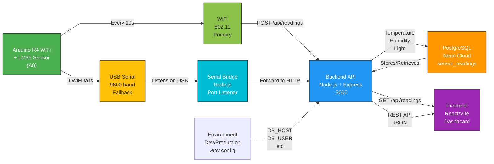
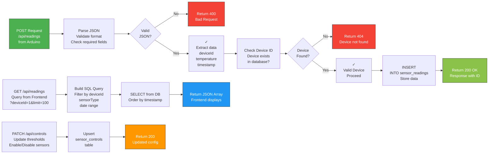

# StaySafe Backend

Express.js API pro senzorová data z Arduino R4 WIFI a řízení domácího prostředí.

---

##  Application Architecture (System Topology)



---

## Backend Process Flow (Data Handling)



---

## Požadavky

- **Node.js** 16+ (ověřeno na v24.14.0)
- **PostgreSQL** 15+ (lokálně nebo cloud)
- **npm** (obvykle součást Node.js)

## Instalace

### 1. Naklonování repozitáře

```bash
git clone <repo-url>
cd StaySafe/backend
```

### 2. Instalace závislostí

```bash
npm install
```

## Nastavení databáze

### Možnost A: PostgreSQL lokálně (výchozí pro vývoj)

#### macOS (Homebrew)
```bash
brew install postgresql@15
brew services start postgresql@15
createdb staysafe
psql staysafe < StaySafe_databaze_postgresql.sql
```

#### Linux (Ubuntu/Debian)
```bash
sudo apt install postgresql postgresql-contrib
sudo -u postgres psql << EOF
CREATE DATABASE staysafe;
\c staysafe
\i /path/to/StaySafe_databaze_postgresql.sql
EOF
```

#### Windows
- Stáhni [PostgreSQL installer](https://www.postgresql.org/download/windows/)
- Během instalace si pamatuj heslo pro uživatele `postgres`
- Otevři pgAdmin 4 nebo PowerShell:
```powershell
psql -U postgres
CREATE DATABASE staysafe;
\c staysafe
\i 'C:\path\to\StaySafe_databaze_postgresql.sql'
```

### Možnost B: Neon Cloud (production)

1. Registruj se na [neon.tech](https://neon.tech)
2. Vytvoř nový projekt
3. Zkopíruj connection string
4. Schéma se nainstaluje automaticky (pokyny viz níže)

## Konfigurace prostředí

### Lokální vývoj

Soubor `.env` je již nakonfigurován pro lokální PostgreSQL:

```env
NODE_ENV=development
DB_HOST=localhost
DB_PORT=5432
DB_USER=<tvůj_os_uživatel>
DB_PASSWORD=
DB_DATABASE=staysafe
```

Pokud máš na PostgreSQL heslo, doplň jej:
```env
DB_PASSWORD=tvoje_heslo
```

### Production (Neon)

Soubor `.env.production` obsahuje Neon credentials. **Necomituj jej!** (je v `.gitignore`)

Pro nasazení na server nastav environment proměnné:
```bash
export DB_HOST=ep-xxxxx.neon.tech
export DB_PORT=5432
export DB_USER=neondb_owner
export DB_PASSWORD=tvůj_neon_token
export DB_DATABASE=neondb
```

## Spuštění

### Vývoj (s hot-reload)

```bash
npm run dev
```

Server poběží na `http://localhost:3000`

### Production

```bash
npm start
```

## API Endpointy

### Senzorová data

**POST** `/api/readings`
- Příjem dat z Arduino
- Body: `{ deviceId, timestamp, temperature|humidity|light }`
- Příklad:
```bash
curl -X POST http://localhost:3000/api/readings \
  -H "Content-Type: application/json" \
  -d '{"deviceId": 1, "timestamp": "2026-04-20T15:30:00Z", "temperature": 22.5}'
```

**GET** `/api/readings`
- Dotaz na uložená měření
- Query: `?deviceId=1&sensorType=temperature&limit=100&from=2026-04-01&to=2026-04-30`

### Řízení sensorů

**GET** `/api/controls?deviceId=1`
- Získání konfigurace prahů

**PATCH** `/api/controls/:deviceId/:sensorType`
- Změna prahů a povolení
- Body: `{ isEnabled: boolean, thresholdMin: number, thresholdMax: number }`

### Upozornění

**GET** `/api/alerts`
- Seznam upozornění

**DELETE** `/api/alerts/:id`
- Smazání upozornění

## Struktura projektu

```
backend/
├── index.js              # Express aplikace
├── db.js                 # PostgreSQL pool a queries
├── routes/               # API endpointy
│   ├── readingsRoutes.js
│   ├── sensorControlsRoutes.js
│   ├── alertRoutes.js
│   └── userRoutes.js
├── controllers/          # Business logika
├── dao/                  # Data access layer
├── middleware/           # Express middleware
├── .env                  # Konfigurace (vývoj) — v .gitignore
├── .env.production       # Konfigurace (production) — v .gitignore
├── package.json
└── StaySafe_databaze_postgresql.sql
```

## Řešení problémů

### Chyba: "Cannot find package 'pg'"
```bash
npm install
```

### Chyba: "database staysafe does not exist"
Zkontroluj, že PostgreSQL běží a schéma je importovaná:
```bash
psql staysafe -c "SELECT table_name FROM information_schema.tables WHERE table_schema='public';"
```

### Chyba: "role 'user' does not exist"
Uprav `.env` na správný OS uživatel (výstup `whoami`):
```bash
whoami  # např. "filiptomanka"
```
Pak uprav `DB_USER` v `.env`

### PostgreSQL neběží (macOS)
```bash
brew services start postgresql@15
brew services list  # ověř, že PostgreSQL je running
```

## Proměnné prostředí

| Proměnná | Výchozí | Popis |
|----------|---------|-------|
| `NODE_ENV` | development | Režim (development/production) |
| `PORT` | 3000 | Port, na kterém poslouchá API |
| `DB_HOST` | localhost | Hostname PostgreSQL serveru |
| `DB_PORT` | 5432 | Port PostgreSQL |
| `DB_USER` | - | Uživatel PostgreSQL |
| `DB_PASSWORD` | - | Heslo PostgreSQL |
| `DB_DATABASE` | staysafe | Název databáze |

## Údržba

### Zálohování databáze

```bash
# Lokální
pg_dump staysafe > backup.sql

# Neon
PGPASSWORD="token" pg_dump -h ep-xxxxx.neon.tech -U neondb_owner -d neondb > backup.sql
```

### Obnovení z zálohy

```bash
psql staysafe < backup.sql
```

## Kontakt

Pro otázky nebo chyby piš do Slacku nebo vytvoř issue v GitHubu.
